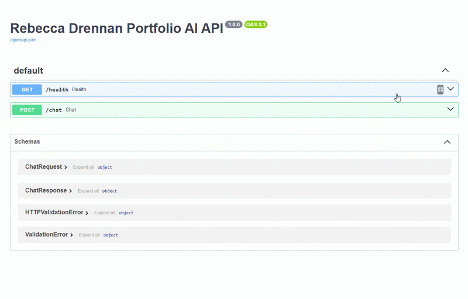

# portfolio-ai-api

[](https://github.com/rebeccadrennan/portfolio-ai-api/actions/workflows/ci.yml)
[](https://github.com/rebeccadrennan/portfolio-ai-api/actions/workflows/codeql.yml)
[](https://github.com/rebeccadrennan/portfolio-ai-api/security/dependabot)

A production-style Python FastAPI backend that powers Rebecca Drennan's AI Portfolio Assistant.

This API is designed to support a React portfolio website where visitors can ask questions about Rebecca's background. The assistant uses Google Gemini with a public-safe markdown knowledge base.

## Demo

Swagger UI walkthrough (health check + chat request):



## What This Project Powers

This backend powers Rebecca's AI Portfolio Assistant experience by:

- receiving portfolio questions from a frontend chat UI,
- loading portfolio context from local files,
- redacting sensitive contact details,
- sending grounded prompts to Gemini,
- returning concise professional responses.

## Tech Stack

- Python 3.11+
- FastAPI
- Uvicorn
- Google Gemini API (`google-genai`)
- Pydantic
- python-dotenv
- pypdf
- pytest
- CORS middleware

## Project Structure

```text
portfolio-ai-api/
  .github/
    ISSUE_TEMPLATE/
      bug_report.md
      feature_request.md
      config.yml
    pull_request_template.md
    workflows/
      ci.yml
  app/
    __init__.py
    main.py
    models/
      __init__.py
      chat.py
    services/
      __init__.py
      gemini_service.py
      knowledge_service.py
    prompts/
      __init__.py
      system_prompt.py
    data/
      .gitkeep
  tests/
    __init__.py
    test_imports.py
  .env.example
  .gitignore
  .editorconfig
  CODE_OF_CONDUCT.md
  CONTRIBUTING.md
  LICENSE
  pyproject.toml
  requirements.txt
  README.md
  SECURITY.md
```

## Quality and CI

- `Quality Gate` workflow runs on push/PR with:
  - Ruff linting,
  - Black formatting checks,
  - test matrix on Python 3.11 and 3.12,
  - dependency vulnerability scanning via `pip-audit`.
- `CodeQL` workflow performs static security analysis for Python.
- Dependabot is configured for weekly updates for both pip dependencies and GitHub Actions.
- Local test command:

```bash
python -m pytest -q
```

- Contributor guidelines are in `CONTRIBUTING.md`.

## Repository Standards

- License: MIT in `LICENSE`.
- Code of conduct: `CODE_OF_CONDUCT.md`.
- Security disclosure guidance: `SECURITY.md`.
- Issue templates: `.github/ISSUE_TEMPLATE/`.
- Pull request template: `.github/pull_request_template.md`.
- Editor consistency settings: `.editorconfig`.

## Local Setup

1. Create and activate a virtual environment.

Windows Command Prompt (`cmd`):

```bat
py -m venv .venv
.venv\Scripts\activate.bat
```

Windows PowerShell:

```powershell
py -m venv .venv
.\.venv\Scripts\Activate.ps1
```

If PowerShell blocks activation, run:

```powershell
Set-ExecutionPolicy -Scope Process -ExecutionPolicy Bypass
.\.venv\Scripts\Activate.ps1
```

2. Install dependencies:

```bash
python -m pip install --upgrade pip
python -m pip install -r requirements.txt
```

3. Create your environment file from the example:

```bash
copy .env.example .env
```

4. Add your Gemini API key in `.env`:

```env
GEMINI_API_KEY=your_real_api_key_here
```

## Getting a Gemini API Key

1. Go to Google AI Studio.
2. Create or sign in to your Google account.
3. Generate an API key.
4. Paste it into `.env` as `GEMINI_API_KEY`.

Never commit your real API key. This repository ignores `.env` by default.

## Knowledge Base

Production knowledge source:

- Markdown files in `app/data/` (including nested folders) are the primary public production knowledge base.

Optional local development source:

- `app/data/LinkedinExport.pdf` can be used locally as an additional context source.
- `app/data/LinkedinExport.pdf` is gitignored and should not be committed.

How to extend knowledge safely:

- Add new knowledge by creating additional `.md` files in `app/data/`.
- The assistant only answers from the loaded context.
- Never add sensitive/private details to public markdown files.
- Never include confidential employer, client, or internal project details.

Important:

- The backend does not scrape LinkedIn.
- Any LinkedIn export PDF must be provided manually for local use only.

## How Knowledge Extraction Works

`knowledge_service.py`:

- recursively reads all `.md` files in `app/data/` and treats them as the main source,
- optionally reads `app/data/LinkedinExport.pdf` with `pypdf` for local development,
- combines loaded content into a single context string,
- includes each markdown file name as a heading before its content,
- gracefully handles missing/unreadable files (no crash),
- redacts sensitive contact details before context is sent to Gemini.

## Sensitive Data Protection

Before sending context to Gemini, the backend redacts:

- email addresses,
- UK mobile-style phone numbers,
- likely home address lines (including postcode/address-like patterns).

This helps reduce accidental exposure of private contact details in responses.

## Run the API

```bash
python -m uvicorn app.main:app --reload --host 0.0.0.0 --port 8000
```

API will be available at:

- `http://localhost:8000`
- Docs: `http://localhost:8000/docs`

## Endpoints

### GET /health

Response:

```json
{
  "status": "ok",
  "service": "portfolio-ai-api"
}
```

### POST /chat

Request:

```json
{
  "message": "Tell me about Rebecca's React experience"
}
```

Response:

```json
{
  "reply": "..."
}
```

Example cURL:

```bash
curl -X POST "http://localhost:8000/chat" \
  -H "Content-Type: application/json" \
  -d '{"message":"Tell me about Rebecca\'s React experience"}'
```

## Connect to a React Frontend

Your React app can call this API from `http://localhost:5173` or `http://localhost:3000` (both are enabled in CORS).

Typical frontend flow:

1. collect user input from chat UI,
2. `POST` to `/chat` with `{ "message": "..." }`,
3. display `reply` in the conversation thread.

## Run Tests

```bash
python -m pytest -q
```

Current tests validate that:

- FastAPI app imports correctly,
- knowledge service imports correctly,
- Gemini service imports correctly.
